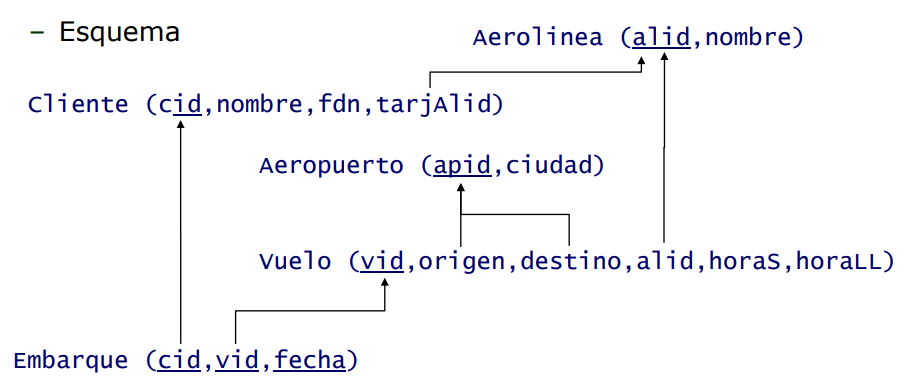
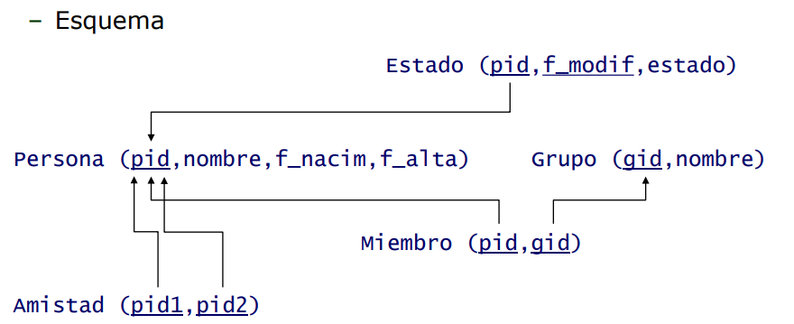

<h1>Documento resumen del proyecto para implementar diferentes bases de datos MySQL</h1>

<ol>
<h2><li>Descripcion del proyecto</li></h2>

Este proyecto consistirá en la creación de diferentes bases de datos relacionales con MySQL donde poder poner en práctica los conocimientos aprendidos sobre esta tecnologia. En este proyecto, se van a realizar tres bases de datos, una que recoge informacion sobre vuelos y otra que recoge informacion sobre una red social. 

<h2><li>Objetivos del proyecto</li></h2>
<ul>
<li>Realizar bases de datos que recojan los datos que se solicitan</li>
<li>Estructurar las bases de datos de la mejor manera posible para aumentar la eficiencia</li>
<li>Realizar consultas sobre las bases de datos que permitan encontrar los datos solicitados</li>
</ul>

<h2><li>Tecnologías utilizadas</li></h2>

Para la creación de esta base de datos se va a utilizar MySQL con MySQL Workbench.

<h2><li>Esquemas de las bases de datos</li></h2>
A continuacion se muestra el esquema de cada una de las bases de datos:

<h3>Vuelos</h3>

<h3>Red social</h3>

<h2><li>Scripts para la creacion de las bases de datos</li></h2>
Los scripts para la creacion de las bases de datos se encuentran en la carpeta "scriptsCreacion". En estos scripts tambien se introducen datos de ejemplo para completar las tablas.

<h2><li>Consultas en las bases de datos</li></h2>
Las consultas realizadas sobre las bases de datos han tratado de realizarse de la manera mas avanzada posible y que puedan extraer conclusiones e informacion sobre los datos. Las consultas sobre cada base de datos se encuentran en la carpeta "consultas".

<h2><li>Resultado final: vídeo youtube y repositorio</li></h2>
Repositorio Github:

<h2><li>Conclusiones</li></h2>

</ol>
